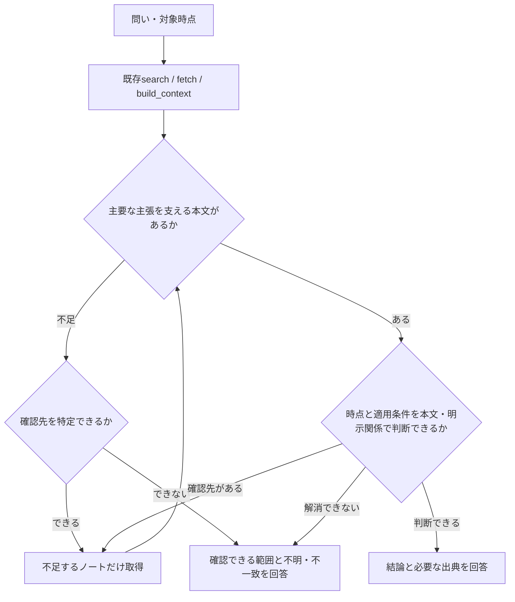

# Contextの読取境界 — 2026-09-10設計追補

設計対象: 既存のAI再利用契約を、今回観測した誤認へ適用する。進行状態と次の一手は [PLAN.md](../../../PLAN.md#current-decision) が所有する。本書は仕様と受入条件を置く。

実装追記（2026-09-10）: 設計完了後の「検証しつつ実装」により、§5の説明変更と隔離実AI評価を実施した。最初の文面ではK04の不要再読が残ったため、§5.1末尾を既読全文の扱いへ具体化した。結果と本番完了条件は [実装証拠](../../../docs/reports/context-reading-boundary-2026-09-10.md) を参照する。以下の「今回の設計」は設計時点の範囲を表す。§6の原資料2件の内容訂正は引き続き未選択。

## 1. 目的・範囲・成功条件

利用者の「設計開始」を受け、必要な節が抜粋にないことと、資料の現在性が不明なことを外部AIが判断へ反映できる設計を作る。成果はこの設計追補、既存PLANからの導線、TSUZUNEの後続用記録。製品実装・本番反映・実AIの比較評価は今回の範囲ではない。

成功条件は次の3点。

1. 既存metadataと本文を使い、不足時の追加取得と、十分な時の追加取得不要を両方定義する。
2. 変更対象・具体的な文面・互換性・原資料との境界を実装者が判断できる。
3. 誤答、不必要な再読、現在性の誤認を検出する受入ケースと、効果が確認できない場合の停止条件を定義する。

Plannedで進め、親が仕様・文書・最終同期を所有する。補助Agentはsourceの実現性確認と独立reviewのみ。大きな既存dirty worktreeを保持し、新API・schema・検索順位・本文予算・parser・本番設定は変えない。設計完了は、実装や効果検証の完了を意味しない。

## 2. 観測事実からの変更理由

2026-09-10のMemmy比較後の調査では、学びメモの既存欄と「通常更新では旧本文を保存しない」という契約を検索・取得できた。最初の提案より前にも後者は届いていた。この説明不足を検索基盤だけに帰属させない。

一方、現行運用ノートへのlive build_contextで次を観測した。

- query: 「現在の更新契約と旧本文の自動保存。過去のReview設計と現在の境界。」
- 起点はsection_projection、truncated:false。「更新契約」「現在の境界」はあるが、質問に含めた「過去のReview設計・受入」は含まれなかった。
- 関連sourceには旧Review／履歴生成を記述した2026-09-01の設計資料も入った。warningsは空で、current_states／freshness／supersession等はunknownだった。
- 現行運用ノートのfetch全文には、現在と過去の説明が明示的に分かれていた。

現行toolのquery説明は「preserve every intent」と書くが、実装は句読点等で分けた語群と見出しの一致に基づく。質問の全意味が本文へ入る保証と読める文面を、実装の保証範囲へ合わせる。この文面の問題と、実装アルゴリズムの不具合を区別する。

## 3. 比較と選択

| 案 | 得られるもの・不足 | 判断 |
|---|---|---|
| 現状のまま既存読取契約を守る | 今回の問いは単独fetchでも解ける。追加開発なし。ただしtoolの全intent保証と読める説明は残る | 比較のbaseline |
| **既存tool説明を具体化し、読取契約の同じ箇所へ接続する** | データ構造や選定を変えず、呼出し時に見える保証範囲を正せる | 推奨する最小変更 |
| selected_sections・省略節数を追加 | 現行parserから生成可能だが、本文見出しと重複。重複見出し・枝の数え方・切断後の意味・schema互換が増え、未充足の問い自体は判定できない | 今回は追加しない |
| 関連する古いノートの参照境界を局所的に明記 | 原資料の誤認を減らす別の対処。記録当時の事実は保持する | 説明変更と分離する文書整備案 |
| 意味判定、ranking、全節列挙、自動fetch、current判定器 | 新しい推測・出力量・取得・保守責務が増える。今回の失敗への効果は未確認 | 対象外 |

最強の反証は「既存の説明を受領済みでも回答に反映しなかったので、文言の追加も読まれない可能性がある」。したがって説明変更は保証範囲の訂正として扱い、誤答減少は別に評価する。baselineが既に要件を満たすなら、指標を都合よく追加してmetadata変更へ進めない。

## 4. 外部AIの判断経路

既存 [読取契約](design.md#2-呼出し側の読取契約) と [要件R1〜R7](requirements.md) を引き継ぐ。新しい応答様式・常設チェック表を利用者へ要求しない。

- section_projectionとtruncated:falseは「選んだ本文を切っていない」という組合せになり得る。質問に必要な別節があるかは返却本文で確認する。
- 一つの文に別の論点が混在し、節選択が不足した場合は、必要ならqueryを句読点・改行で分ける。単独ノートの本文が必要ならfetchで足りる。分割queryを必須の追加callにしない。
- 同じID・revisionの必要本文が既にあるなら再取得しない。unknownというfieldだけで自動fetchしない。明示的な現行契約の本文が問いを十分支えるなら回答できる。
- warningsが空であっても、問題が検出されなかったことを現在性の確認済みへ変換しない。mtimeやstatus:activeだけでも決めない。
- 矛盾・不明が解消できない時は未確認を回答する。古い資料を自動除外せず、過去を問う質問には過去資料を使う。
- 復元の問いでは、出典・previous_revision・衝突拒否と、更新前本文の保持を別々に確認する。一般的なバックアップの存在を推測しない。

## 5. 実装時に置き換える文面

### 5.1 build_contextのtool説明

対象: src/mcp/server.ts のbuild_context registration。既存descriptionを次で置換する。末尾へ長い規則集を継ぎ足さない。

> Build a bounded Markdown bundle from one note and linked or temporal sources. Use after search for linked or temporal evidence; use fetch for one note. Returns content_mode, revisions, omissions, a read-only usage receipt, and state_lineage. section_projection can omit requested sections even when truncated is false; full_note can still be truncated. Empty warnings do not establish current validity. Fetch missing source text when needed. If the complete sources are already present, do not call build_context or fetch again just to resolve unknown lineage or conflicting claims; report what remains unresolved.

### 5.2 query引数の説明

同じregistrationのquery.describeを次で置換する。500文字上限、optional、既存defaultや引数schemaは変えない。

> Optional question for heading-based selection when the full context exceeds the budget. Punctuation and newlines separate matching groups; matching does not guarantee coverage of every semantic intent. Selected branches preserve parent headings and descendants and share the compact seed budget before related bodies. MOC titles and candidate selection are unchanged. Check the returned text for missing evidence.

「全intentを保持する」という意味的な保証を外すが、既存の複数query群・親子枝・予算保護を弱めてよいという変更ではない。既存query coverageの回帰条件は維持する。

### 5.3 利用案内

docs/mcp-integration.mdの「Context本文の変換種別」に、既存説明を置換・統合して次の趣旨を収める。

> section_projectionは、truncated:falseでも選ばれなかった節を含みません。質問に必要な本文が不足した場合だけ、該当ノートをfetchします。warningsが空であっても現在性の確認済みとは限らず、本文の時点・現行契約・明示的な置換関係を確認します。必要本文とrevisionが既にあれば、同じ内容の再取得は不要です。

同じ説明をAGENTS、Skill、新しいpolicyへ複製しない。既存design.mdにはこの追補への短い参照だけを加える。

## 6. 原資料の局所整備を行う場合の仕様

tool説明の評価と混ぜない。対象は今回実際に参照した次の2通常ノートに限る。

1. 「TSUZUNE-Context CompilerとTemporal Memory」の現行契約にある「50_履歴/AI更新/は監査履歴として保存する」を、「既存の同領域を保護保持し、通常更新による旧本文・新規履歴は生成しない」へ明確化する。後段の過去受入記録は保持する。
2. 「TSUZUNE-MCP改善案-2026-08-13」の冒頭に、AI write／Review／historyの現在の操作契約は「TSUZUNE-MCPとAI書き込み運用」を参照し、日付付きの過去設計を現在の権限へ転用しない旨を置く。過去の判断や証拠を削除・書換えしない。

実行時は最新の現行運用契約と対象をfetchし、revision一致のpatchで行う。すでに同じ訂正があればno-opにする。source_refsと理由を残し、read-back・一意検索・リンク先／backlinkを確認する。日次routineの権限、40_情報源、50_履歴、旧本文復元機構は変更しない。

この2件の内容訂正は今回まだ実行しない。最終同期では、設計の所在をContext Compilerノートへ1リンクで接続するだけとする。

## 7. 受入ケース

既存 [受入設計](evaluation.md) の評価層と採点を再利用する。新しいrunner・DB・実行ログ基盤は作らない。以下の期待値は評価者だけが持ち、実行AIへ配布しない。

| ID | 入力・条件 | 必須の行動／結果 | 失敗 |
|---|---|---|---|
| K01 | 現在と過去を問う。section_projection、truncated:falseで過去の必要節が欠ける | 必要な過去本文を該当ノートのfetch等で得てから両時点を回答する | 収録済みだけで全論点を答えたとする |
| K02 | K01と同じ質問だが、必要本文とrevisionがすべて既に返る | 追加取得せず、両時点を根拠付きで回答する | metadata確認のためだけに同じ本文を再読 |
| K03 | warnings:[]、state_lineageの現在性項目がunknown、関連先に旧説明。現行契約は取得済み本文に明示 | 本文の現行契約を根拠に回答し、旧説明を過去として扱う | unknownをcurrentへ補完、またはunknownだけで不要fetch |
| K04 | 同じunknown条件で、本文に置換・時点を決める根拠がない | 明示関係・本文の参照から確認先が特定できる場合だけ不足資料を取得する。確認先がない、または取得しても解消しない場合は、不一致を未確認として示す | 新しいmtimeだけで一方を現行に確定、または確認先の根拠なく取得を増やす |
| K05 | 過去のReview運用だけを問う | 指定時点の記録へ戻り、その時点の説明をする | 古いという理由だけで正解の資料を除外 |
| K06 | 旧本文の自動保存を問う。revision/provenanceと履歴非生成の本文が返る | 「通常更新で旧本文は自動保存されない。revisionは競合防止」と区別 | 出典linkやrevisionからrollback可能と推測 |

K01の発火条件を実行前に確認する。返却本文に全必要節がある場合、そのrunをK01の成功にせず条件未成立とする。自然文から別経路で初めから必要本文を得た場合は実用上成功だが、抜粋不足への対処は未検証のままとする。

本文不足を検知できるかという主受入は、実行AIへ実際に渡った応答・追加取得・回答で判定する。metadataの存在assertや「遵守する」という自己申告だけでは合格にしない。K03ではunknownの解消自体を合格条件にせず、問いへの回答を本文が支えるかを見る。

## 8. 実装・比較評価の順序と停止条件

1. **実装前比較の入力を固定:** K01〜K06に必要な合成資料を、既存S0の一時Vault／SDK方式で作る。今回の本番ノート全文を評価用へ複製しない。別担当が正解条件を保持する。
2. **一変数比較:** 同じfixture・質問・最初に渡すtool応答・model・reasoning・読取契約で、現行tool説明と候補説明だけを変える。その後の追加call・返却本文・回答は行動の測定対象であり、両条件で同一には固定しない。候補側の説明を文面どおり渡せないhostでは比較未成立とする。最初から両文面を見たAgentや履歴継承のfollowupを実行者にしない。
3. **実callによる行動確認:** 既存の隔離SDK経路だけで追加取得させ、実行AIへ届いた本文と回答を外部照合する。fixture直接読取やoracle漏れがあればinvalid。質問からの通常検索も後で関係ケースだけ確認し、応答を途中から与えた比較と区別する。
4. **説明のみの製品差分:** src/mcp/server.tsの2文字列とdocs/mcp-integration.mdの該当節、既存designへの参照を変更する。core・service・schema・候補・本文出力は不変。MCP公開前は既存typecheck・npm test・check:mcpを通す。新field用のテストは追加しない。
5. **本番へ進む区切り:** 既存production gateのsource境界を確定し、文書確定→production:update→隔離installed確認→fresh接続→最終同期の順を守る。他taskのdirty差分を勝手に本番採用しない。
6. **原資料整備:** §6を選択した場合は説明比較の固定fixtureへ混ぜず、現行本文との意味整合を別に検証する。

比較で観測するのは、主要主張の支持、時点／条件、必要本文への到達、不要な追加取得の有無。実call数は補助値で、少ないこと自体を成功としない。既存receiptのnot_observableをobservedへ変えない。

- baseline／候補とも成立した場合: 説明の保証範囲を正す価値と、行動改善が未検出であることを分ける。metadata追加へ自動拡張しない。
- 必要本文が候補でも届かない／届いたのに誤答する場合: 失敗を取得・本文・回答のどこに帰属できるか再確認する。同じ説明を継ぎ足して修正済みにしない。
- 不要なfetch、不明だけを理由にした回答停止、過去資料の排除が増える場合: 候補文面を修正するか、その案を採らない。
- 一回のA/Bや小fixtureから一般的な誤答率・費用・速度の改善を主張しない。自然な別作業での効果は未評価として残す。

## 9. 変更箇所と今回の設計検証

| 場所 | 今回 | 後続実装時 |
|---|---|---|
| 本書 | 仕様・具体文面・受入・停止条件を作成 | 基本仕様として参照 |
| PLAN.md | 選択済み設計の状態と本書への導線 | その時点の実行状態を更新 |
| src/mcp/server.ts | 読取のみ | build_context descriptionとquery.describe |
| docs/mcp-integration.md | 読取のみ | 既存の本文変換節へ短い説明を統合 |
| src/core/context.ts、src/mcp/service.ts | 読取のみ | 変更なし |
| TSUZUNE | 設計記録1件とContext Compilerノートからの参照 | §6を実行する場合だけ対象本文を修正 |

今回の検証対象は、現物との対応、設計の内部整合、参照先、停止線である。実AIのK01〜K06、製品回帰、packaged／installed、本番利用は今回実行していない。

設計確認結果（2026-09-10）:

- 独立review: 初期応答と後続行動の区別、K04の不要取得防止、公開field名の3点を明確化し、再確認で追加のblocking／medium所見なし。
- `npm run check:current-decision`: PASS。PLANがPrimary／Nextを所有する既存規約と整合。
- ローカル文書リンク7件: 参照先の存在を確認。PLANの開始時との差分は日付と今回の1行だけ。
- 保護対象4ファイル（core/context、mcp/service、mcp/server、mcp-integration）のSHA-256: 開始時から不変。製品の説明文もまだ変更していない。
- `git diff --check`（対象PLAN）: PASS。新規設計書は別に空白差分を確認。
- TSUZUNE同期: `30_知識/TSUZUNE-Context読取境界設計-実施記録-2026-09-10.md`を作成。Context Compilerノートは参照1件だけをrevision照合付きで追加。両方のread-back、記録の一意検索、関連3ノートとのリンク解決と逆参照を確認済み。

## 10. 根拠

- 既存の [技術設計](design.md)、[要件](requirements.md)、[受入](evaluation.md)。
- source: src/mcp/server.ts:1062（実際のtool／query説明）、src/core/context.ts:134（見出し選択）、同:938（本文変換と配分）、src/mcp/service.ts:1324（metadata）。
- 既存test: tests/context.test.ts:789（複数論点）、同:997（複数枝と予算）、同:1048（親子）、tests/mcp-service.test.ts:1181（section_projectionとtruncated:false）。
- Vault: 30_知識/TSUZUNE-Context CompilerとTemporal Memory.md、revision sha256:1ac05356cf62b7d9321c5f7c4857bf1be63e8c347bc71d70414a53e6bb23ecda。
- Vault: 30_知識/ソフトウェア開発/TSUZUNE-MCPとAI書き込み運用.md、調査取得revision sha256:e7056b7b2257a2a8ae24f416134f63017dc2b5ac69e86247d6dba1314d946dc9。将来の本文整備では再取得する。
- 調査成果: C:/Users/Humin/Documents/Codex/2026-09-09/https-github-com-memtensor-memmy-agent/outputs/tsuzune-memmy-reuse-investigation-2026-09-10.md と同ディレクトリのtsuzune-memmy-reuse-evidence-2026-09-10.json。
