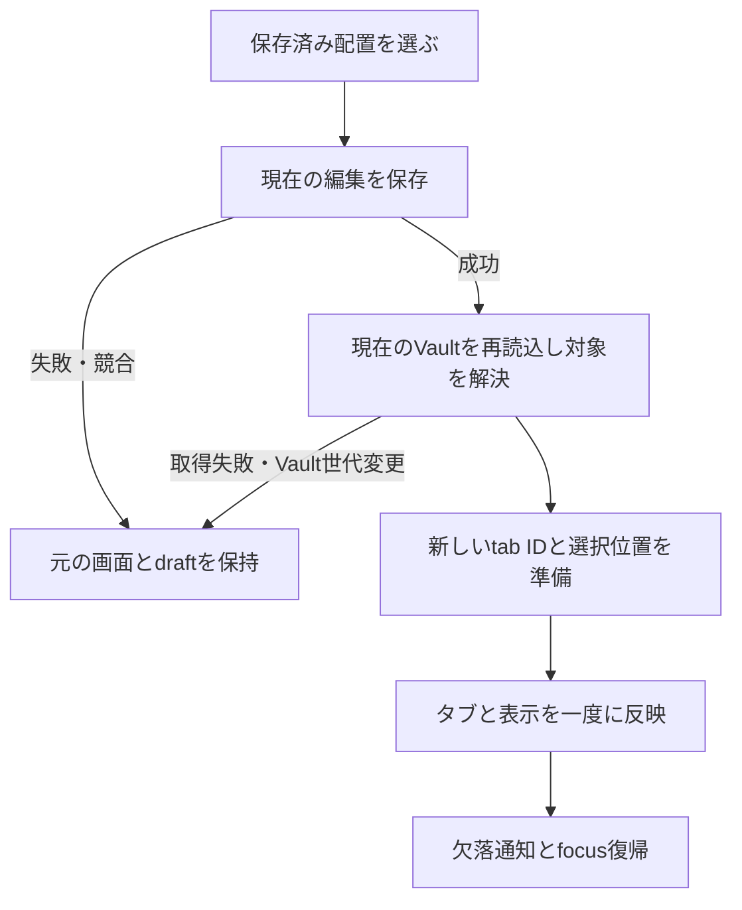

# ワークスペース保存・復元 — 技術設計

設計日: 2026-09-06 JST。製品実装は未着手。要求と操作の正本は [requirements.md](requirements.md)、合格条件は [acceptance.md](acceptance.md)。現在の実行状態は [PLAN.md](../../../PLAN.md#current-decision) を参照する。

## 1. 既存経路と変更の根拠

| 根拠 | 現在の実装／設計への意味 |
|---|---|
| `src/renderer/components/WorkspaceTabBar.tsx:7` | note／attachment／linked-view／global-graphのunion。runtimeの数値IDを永続化しない |
| `src/renderer/App.tsx:217`、`:243`、`:312` | タブ、選択、単一の編集buffer、表示mode、左右sidebarを保持。新たなdraft storeは不要 |
| `src/renderer/App.tsx:190` | `restoredLastNote`は完全pathを優先し、既存の明示path aliasだけ解決する。名前付き配置にも同じノート解決を使う |
| `src/renderer/App.tsx:528`、`:606`、`:696` | `beginOperation`、`flushSave`、busy時の編集拒否。復元を一つの排他操作として扱う |
| `src/renderer/App.tsx:730`、`:823` | snapshotの世代・要求順序と外部変更queue。復元中のVault変更を検出する |
| `src/renderer/App.tsx:932`、`:998`、`:2094` | 起動時はlastNoteだけ復元。終了前は本文flush。tab activationの枝を新しい復元commitと共用する |
| `src/renderer/components/RelatedNotes.tsx:45` | 右文脈の選択は子componentのstate。これだけAppへ持ち上げ、既存ARIA動作を維持する |
| `src/shared/types.ts:122`、`src/main/settings.ts:29` | AppSettingsはprofile内settings.json一件。現在はVault別配置なし、read失敗はdefault、writeは直接writeFile |
| `src/main/ipc.ts:58`、`src/main/index.ts:47` | trusted IPCの直列queueとsingle-instance lockを再利用する |
| `src/main/google-connection.ts:141` | privateなatomic JSON書込の既存パターンあり。共有helperはないためsettingsへ同じ最小手順を置く |

既存DB／外部package／常駐処理は不要。settingsを使う反証は、現在の直接書込と読込失敗時defaultが、名前付き保存を失わせ得る点。そのためW1の前提にatomic保存と厳密な書込用読取を含める。別storeはこの小さな保存責務だけでは採用しない。

## 2. 保存形式と所有

既存`settings.json`へoptionalな`workspaceStateByVault`を追加する。各Vaultのvalueを次のV1形式にする。root keyはmainの単一関数`canonicalWorkspaceVaultKey`で、開いているVaultの`realpath`・Windows path正規化・大文字小文字の同一視から求める。rendererはkeyを計算しない。realpath失敗なら操作を中止して旧設定を保持する。rendererが任意保存先を指定するAPIにはしない。Vaultを別位置へ移した場合の自動引継ぎはしない。

```ts
type SavedTab =
  | { kind: 'note' | 'attachment' | 'linked-view'; path: string }
  | { kind: 'global-graph' }

type WorkspaceSnapshotV1 = {
  tabs: SavedTab[]
  activeIndex: number | null
  noteView: 'edit' | 'preview' | 'local-graph'
  left: { open: boolean; view: 'files' | 'search' | 'bookmarks'; query: string }
  right: { open: boolean; view: 'outline' | 'links' | 'backlinks' | 'temporal' }
}

type VaultWorkspacesV1 = {
  version: 1
  lastSession: WorkspaceSnapshotV1 | null
  named: Array<{
    name: string
    savedAt: string
    snapshot: WorkspaceSnapshotV1
  }>
}
```

- `tabs: [] / activeIndex: null`は有効な空配置。`lastSession: null`やfield自体の不在と区別する。非空ならactiveIndexは配列内の整数を必須とする。同じpathの複数タブは位置ごと保持する。Global Graphは既存仕様どおり最大一つ。
- noteViewは**選択中のnoteだけ**へ適用する。非noteがactiveなら復元commitで表示枝を優先し、隠れた編集bufferを引き継がない。inactive noteへ後で移るときは既存のpreview規則を使う。per-tabのmode管理は新設しない。
- Graphのfilter／group／scale／queryは既存共通設定が所有する。workspace内へ複製しない。Local Graphの中心はactive noteから得る。
- 名前は前後空白を除いた1〜80 Unicode code points。改行・制御文字は不可。名前をfile名やpathに使わない。大小文字を含め完全一致の名前だけ更新対象とし、Unicodeの変換で異なる名前を黙って統合しない。
- 保存日時はmainで付ける。名前とsnapshotが同じならsavedAtもfileも変えない。MCP、Vault Markdown、`.obsidian`、`.tsuzune`、同期manifestへ配置を書かない。
- 保護上のV1境界は1 Vaultあたり名前付き50件、1配置200タブ、検索文字列4,096 code points。超過時は一部だけ保存せず、理由を示して保存全体を拒否する。`ponytail:` 本人一台の小さな作業セット向け。実利用で上限へ到達した場合に保存サイズと操作時間を測って見直す。設計時の性能実測値ではない。

## 3. Main／preload契約

既存trusted main-frame IPCと`runInOrder`を通す四操作に限る。既存の`Result<T>`を使い、汎用setting全体の置換APIは追加しない。

| 操作案 | 入力と結果 |
|---|---|
| `getWorkspaces` | expectedVaultPath → 現Vaultの名前付き配置、lastSession、現在のscope |
| `saveWorkspace` | scope、name、snapshot、replaceExisting → 保存後一覧。既存名でreplaceExisting=falseならALREADY_EXISTS |
| `deleteWorkspace` | scope、name → 保存後一覧。対象なしはNOT_FOUND |
| `saveLastWorkspaceSession` | scope、snapshot → 完了／no-op |

`expectedVaultPath`はその時点でrendererが受け取ったrootのhint。mainの同じcanonical関数でhintと現在のrootを比較し、case-onlyの表記差を別Vault扱いしない。`scope`はmainが返す`{ rootPath, rootRevision }`で、既存`VaultService.rootRevision`（root設定／解除で増加）を読取getterから使う。scopeは永続化せず、rendererは受け取った値をそのまま返す。

mainは各mutationのqueue実行時と非同期準備後のpatch直前にscopeのrootRevisionとrootを現在値へ照合する。同じpathへ戻ったA→B→Aでも旧要求を拒否する。renderer側も全要求の送信前に自身のVault世代とrootをcaptureし、**IPC成功応答の後も**照合してから一覧／画面／次timerを更新する。getだけが新しいAを読めたとしても、旧世代のresponseは画面へ反映しない。実際のkeyと保存fileはmainが決める。

tabのpathはVault相対だけに制限し、absolute／UNC／drive付き／`..`／NUL／不正kindを拒否する。添付は既存の対応拡張子、noteとlinked-viewはMarkdownに限定する。root配下の実在確認とsymlink/junction境界は既存Vaultのsafe read／scan契約を使う。

IPC入力の未知fieldや型誤りは書込み前に拒否し、欠落fieldを推測で補わない。保存済みV1の構造破損・未対応versionは、その配置を空扱いで書き直さず読み込みエラーにする。現在存在しないpathは構造破損ではなく復元時の欠落として扱う。

### settingsの保存保護

`readSettings`のUI向けdefaultと、`updateSettings`の書込用読取を区別する。書込前に既存JSONを厳密に読み、ENOENTだけ新規設定を許す。parse／permission等の失敗は書込を中止する。既存のraw objectへ検証済みpatchだけをmergeし、無関係な設定・他Vault・未対応workspace valueを保持する。workspaceを操作するときだけ対象valueのV1を検証し、未対応版へ上書きしない。

同一directoryの一意tempを`wx`で作成 → 内容write → close → renameで置換する。失敗時は旧settingsを保持し、task-owned tempだけcleanupする。保存成功はrename成功後。既存IPC直列化を再利用し、別lock managerやcacheは作らない。電源断で最後の配置まで必ず保持する保証はしない。Windowsのrename失敗、直接呼出し経路、既存setting更新との交互実行をA9で検査する。

## 4. Rendererの保存と復元

### 名前付き保存

ダイアログで名前を確定 → IME確定済みを確認 → `beginOperation` → 現在のVault世代とscopeをcapture → `flushSave` → 成功とdirty解消を確認 → 一貫したstateからsnapshotを組立 → mainへ保存 → 成功後の世代照合を通した場合だけ一覧と通知を更新 → `finishOperation`。保存／更新操作は配置を切り替えない。失敗ならdraft／選択を保持する。削除は本文を保存・変更せず、名前付き一件だけを削除する。

### 復元



1. 一つの`beginOperation`内で、最初に本文flushを完了する。DOMのinert・既存busy guardを維持し、IME確定前に保存・読込を発火させない。開始前のcapture／他modalのdirtyを勝手に破棄しない。
2. 保存前のsnapshotをそのまま使わず、flush後に現Vaultのfresh scanを既存経路で得る。要求root・Vault世代・復元要求番号を前後で比較し、不一致ならcommitしない。外部変更イベントは既存queueへ留め、終了後に処理する。
3. noteとlinked-viewは既存`restoredLastNote`相当の完全path優先＋明示path alias解決、attachmentは現在のattachments一覧への完全path照合で解決する。case比較は現在のWindows規則を使う。path alias以外のbasename／類似名推測はしない。
4. 欠落タブだけを除いた候補配列をmemory上で組む。activeは保存時indexに対応する生存タブ、なければ先頭の生存タブ。全件欠落なら空画面＋欠落一覧。意図した空配置なら通知不要。無関係な先頭ノートを新しく開かない。
5. 新規のruntime IDを採番し、配列・active・関連表示を一度の同期commitで反映する。`loadWorkspaceTab`を配列の回数だけ呼ばず、tab種別の適用部分だけ小さく共用する。古いselectedPath／attachment／linked-viewと編集bufferは新activeに合わせてクリアする。
6. active tabへfocusを置く。空ならファイル一覧の既存入口へ戻す。編集modeを保存していても、復元直後のキーを誤入力しないようfocusはtabに置く。
7. 保存済みnamed snapshotは欠落やalias解決で自動更新しない。通常の読込成功はlastSessionを更新する。欠落があった復元では元のlastSessionを保持し、その後の利用者による構造変更までcheckpointを抑止する。起動・通知を閉じる・unmount・通常終了だけで欠落参照を消さない。以後の明示的なタブ／表示変更は現在の画面を新lastSessionとして保存できる。通知の「見つからないタブを前回の配置から外す」も明示操作として現在配置を保存し、成功後だけ通知を消す。失敗時は通知を保持し、本文とnamed snapshotは変更しない。

scan後に外部変更が起きた場合は既存watcherと次回revision付きsaveで処理する。配置は本文のrevisionや内容を持たないため、保存済み配置から過去本文を再投入する経路を作らない。

### 前回の作業状態と再起動

- タブopen／close／順序／active、保存対象の表示変更をcheckpoint対象とする。300ms debounceで最後のsnapshotだけ送る。検索文字列は500ms idle／IME確定後。本文の各入力やGraph simulationはcheckpoint対象外。
- timerには作成時のroot・世代・snapshotを持たせる。復元・Vault切替開始時は古いtimerをcancelし、必要な旧Vaultのcheckpointを旧rootが有効な間にawaitする。起動中や復元commitの途中の空stateを書き戻さない。
- 起動／Vault切替では、まずsettingsとVaultを用意し、対象VaultのlastSessionがあれば復元する。fieldなし／nullなら現在のlastNote復元へfallbackする。空配置なら空のまま。構造破損／未知versionなら警告して通常画面を使い、保存データを初期化しない。
- 通常終了は既存`app:requestClose`で、capture確認 → 排他状態で本文flush → pending timer取消・最終checkpoint await → `confirmClose(true)`とする。途中の編集・タブ操作を受け付けず、本文保存が失敗したら閉じない。
- 配置の保存だけが失敗した場合は「前回の配置を保存できません。配置を保存せず終了しますか？」で、終了／戻るを選べる。本文保存成功を条件にする。クラッシュ時は最後に成功したcheckpointまでで、未保存本文の回復機能ではない。
- 読込後のlastSession保存が失敗した場合、読み込めた画面を戻さず「配置は開けましたが、次回の再開用には保存できませんでした」と通知する。次回起動は最後に保存成功したlastSessionから再開する。次のcheckpoint対象操作または通常終了で再試行し、常駐retry loopは作らない。名前付き保存成功とは取り違えない。

## 5. 表示・入力の境界

既存Command Paletteとdialogのfocus trap／Escape／単一modal規則を再利用する。保存入口では名前input、開く入口では保存済み先頭をfocus。日本語名のIME中Enterは確定専用。削除確認の既定focusはキャンセル。閉じる／失敗は起動元へ、読込成功は新active tabへ戻す。loadingとerrorはlive regionで通知し、色だけで示さない。

現行MarkdownEditorにはAppへcomposition状態を伝える経路がないため、`onCompositionStart/End`相当の通知を追加する。CodeMirrorの確定後の最終docが`onChange`経由でcontentRefへ届くまでcomposition中として扱う。composition中はworkspace入口・save／load・終了を開始せず、`beginOperation`より前で戻す（自動再実行はせず確定後に再操作）。WorkspaceDialog／Command PaletteのEnterも`isComposing`または`key === 'Process'`ならsubmitしない。これによりbusyで確定入力を捨てる経路を避ける。DOMイベント順序はA4の実editorと隔離実機IMEで確認し、keydown mockだけのPASSでは日本語入力保全を証明しない。

右文脈のactiveTabだけをAppへliftし、propsで渡す。tabpanel内容は現在のnoteから再計算する。幅は既存CSSのresponsive配置に従い、狭幅では利用可能な中央幅を優先して一時的に閉じる。保存したopen希望値と画面幅によるeffective表示を分け、resizeイベントだけで保存値を上書きしない。

## 6. 実装順

実装指示を受けたら次の順に進める。W-A〜W-Cは同一機能の内部手順で、別の採用待ち候補を作らない。

1. **W-A 保存契約**: `src/shared/workspace-state.ts`の小さな型／parser、settingsの厳密merge／atomic化、Vaultの既存rootRevisionを返すgetter、限定IPCとpreloadを追加。異常系を含むA5、A9、A10から確認する。
2. **W-B 名前付き操作**: Appのsnapshot化／排他的restore、MarkdownEditorのcomposition通知、RelatedNotesの選択lift、`WorkspaceDialog.tsx`、コマンド2件を接続。A1、A2、A4、A6〜A8、A11を確認する。
3. **W-C 再開**: 同じ形式のlastSession、起動／Vault切替／終了handshake（composition完了前の終了拒否を含む）へ接続し、A3と新規process受入を通す。UI回帰、必須gate、隔離installed受入までを別の実装契約で完了する。

settings変更は既存Graph・Calendar・最後のVault／noteの設定を巻き込むため、その回帰を省略しない。保存保護・dirty保持・Vault分離のblocking findingがあれば次段階へ進まない。実装された製品変更の完了にはrepositoryのproduction update契約が適用される。現在は設計のみなので本番再導入しない。

## 7. 公式比較の根拠と限界

2026-09-06に公式 [Workspaces](https://obsidian.md/help/plugins/workspaces) を確認。公開説明の保存対象は開いているファイル／tabsとsidebar幅・表示。名前でSave、同名Saveで更新、Load、Deleteを提供する。起動時のtabs／layout復元は [Help and support](https://obsidian.md/help/Help%20and%20support) のstartup time項目に別途記載される。

TSUZUNEでは現行の単一中央paneの範囲を設計し、幅変更やObsidian内部file形式は採用しない。公式説明のみからスクロール・未保存buffer・plugin状態の同等性を主張しない。固定Obsidianとの実機paired比較、実装test、本人の受入は今回未実施。
