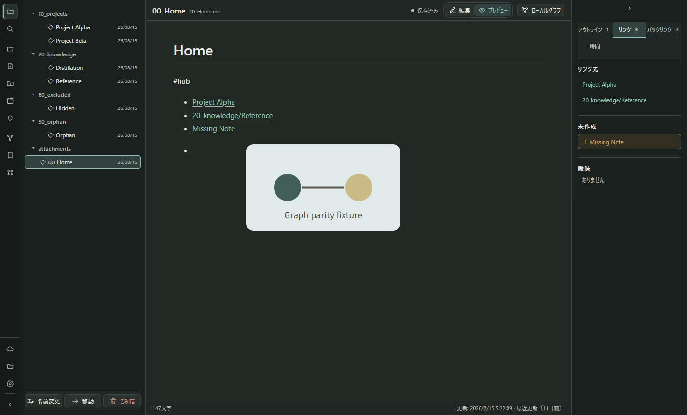
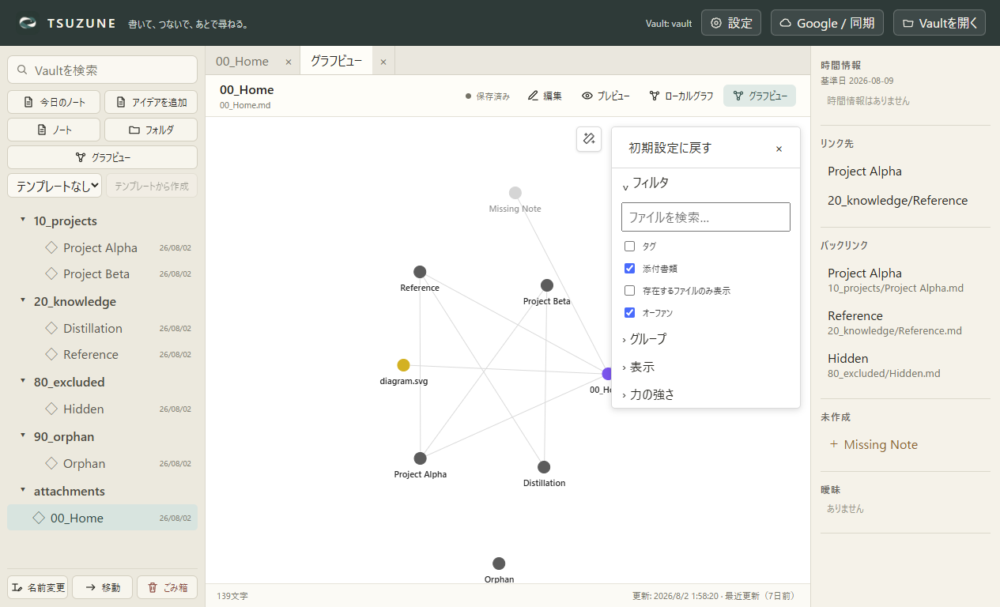

# TSUZUNE

**書いて、つないで、あとで尋ねる。**

TSUZUNEは、普通のMarkdownファイルを原本にするWindows向けの個人用知識ワークスペースです。人はMarkdown記法を覚えなくてもメモを残せ、CodexやChatGPTは出典と履歴を保ちながら必要な知識を読み書きできます。

| ノートを自然に書く | 知識をGraphでたどる |
|---|---|
|  |  |

## TSUZUNEでできること

- **自然に書く** — 通常ノート、同日一件の「今日のノート」、フォーム式の「アイデアを追加」、簡易書式ツールバー。
- **Markdownのまま残す** — ノートは`.md`、添付は通常ファイル。TSUZUNEがなくても一般的なeditorで読めます。
- **知識をつなぐ** — `[[Wiki link]]`、backlink、未解決link、全文検索、Local/Global Graph。
- **古さに気づく** — 最終更新日時と任意の`review_after`から、再確認の目安を非破壊で表示。
- **時間を区別する** — 現在・過去・未来、情報が有効だった時点とAIが知った時点を分離。
- **AIと共有する** — MCP経由で検索、取得、Context構築、競合検知付き更新、履歴付きAI更新。
- **任意で同期する** — Google接続と専用Drive folderへの手動preview/apply。ローカル利用だけでも動作します。
- **Windowsで使い続ける** — user単位installer、アプリ内更新、packaged/installed smokeを含む本番更新gate。

## 現在地

| 対象 | 状態 |
|---|---|
| インストール済み本番 | [Project Status](PROJECT_STATUS.md)と最新production receiptを参照 |
| 現在の開発slice | [Product Plan](PLAN.md)のActive Trackを参照 |
| Repository | Private personal project |

本番commit、検証済み範囲、未証明境界、次の一手は[PROJECT_STATUS.md](PROJECT_STATUS.md)を正本とします。実行順は[PLAN.md](PLAN.md)、資料とEvidenceは[docs/INDEX.md](docs/INDEX.md)から辿れます。

## 使い始める

1. [Private Releases](https://github.com/imonoonoko/TSUZUNE/releases)または手元で配布された`TSUZUNE-Setup-0.5.0.exe`を起動します。
2. Start menuまたはdesktopの「TSUZUNE」を開きます。
3. 「Vaultを開く」から、Markdownを保存するfolderを選びます。
4. 「ノート」「今日のノート」「アイデアを追加」のいずれかで書き始めます。

現在の個人用buildはcode signingしていないため、Windowsが発行元不明の警告を出す場合があります。入手元を確認して実行してください。通常のinstall先は`%LOCALAPPDATA%\Programs\tsuzune`です。uninstallしてもVaultは削除しません。

## 毎日の書き方

### Markdownを知らない場合

- 「今日のノート」は日付を自動入力し、今日やったこと、気づき、次にすることをフォームで保存します。
- 「アイデアを追加」は、内容、思いついた理由、関連project、次の一歩をフォームで保存します。
- 見出し、太字、list、check、linkはtoolbarから挿入できます。
- `90_テンプレート`へ雛形を置けば、通常ノート作成時に選べます。

裏側では通常のMarkdownへ保存するため、検索、Wiki link、Graph、MCPとの互換性を失いません。詳しくは[Templates and Freshness](docs/templates-and-freshness.md)を参照してください。

### Wiki linkを使う場合

```markdown
# プロジェクト概要

関連:
- [[開発方針]]
- [[10_プロジェクト/TSUZUNE|TSUZUNE]]
```

link先、backlink、未作成・曖昧・無効linkを右panelで確認できます。Local Graphは現在ノートの直接linkだけ、Global Graphは孤立ノートを含むVault全体を表示します。

## Codex・ChatGPTと連携する

TSUZUNEで使うVaultを一度開いた後、開発repositoryで次を実行します。

```powershell
npm run mcp:register
```

公開するMCP toolは7つです。

| Tool | 用途 |
|---|---|
| `search` | title、path、本文を検索 |
| `fetch` | Markdown noteとrevisionを取得 |
| `get_backlinks` | backlinkを取得 |
| `build_context` | 起点と関連noteを文字数上限付きで構築 |
| `create_note` | 既存folderへ新規noteを作成 |
| `update_note` | revision一致時だけ更新 |
| `autonomous_update_note` | 通常noteを更新し、旧本文を`50_履歴/AI更新`へ保存 |

AI更新でも出典、理由、旧revisionを履歴へ残します。Raw Source、監査log、削除、移動、強制上書き、Google認証・同期はMCPへ公開しません。ノート/フォルダ単位の`auto`、`review`、`immutable`切替UIは将来計画で、現在は未実装です。

登録解除:

```powershell
npm run mcp:unregister
```

詳細は[MCP Integration Guide](docs/mcp-integration.md)を参照してください。

## Google接続は任意

Googleへ接続しなくても、local Vault、Graph、MCPを使えます。標準接続は基本profileと`drive.file`に限定し、TSUZUNE専用Drive folderを手動でpreview/applyします。Calendar読取を有効にした場合だけ、`calendar.events.readonly`を追加で要求します。

- Google広告profile、検索履歴、他appのDrive全体は取得しません。
- token、OAuth JSON、account情報をVaultやGitへ保存しません。
- Drive上の削除をlocalへ自動伝播しません。
- 別端末受信と競合を含む完全なroundtrip dogfoodは未完です。

OAuth build、credential保存、update/releaseの運用は[Windows Production Guide](docs/windows-production.md)を参照してください。

## データ保護

- 保存前に更新時刻を照合し、外部変更との競合を通知します。
- 保存は同じfolder内の一時fileを経由します。
- renameとmoveは既存項目を上書きしません。
- deleteはVault内`.trash`へ退避します。
- dot folderとsymbolic linkはVault一覧から除外します。
- cache、index、GraphはMarkdownと添付から再構築可能に保ちます。

## 開発する

必要環境:

- Windows
- Node.js 22
- npm 11

```powershell
npm ci
npm run dev
```

主な検証:

```powershell
npm run typecheck
npm test
npm run check:mcp
npm run build
```

installerとこのPCの本番更新:

```powershell
npm run pack:win
npm run check:installer
npm run check:packaged
npm run production:update
```

`production:update`は製品codeを変更した検証済み区切りでだけ使います。文書・調査だけの変更では同じbinaryを再installしません。

## Documentation

- [Project Status](PROJECT_STATUS.md) — 現在の本番、最新検証、次の一手
- [Product Plan](PLAN.md) — 実行順、受入条件、保留Track、長期roadmap
- [Product Definition](PRODUCT.md) — 製品原則と非目標
- [Design System](DESIGN.md) — GUI、brand、accessibility
- [Documentation Index](docs/INDEX.md) — 機能別guideとEvidence
- [Obsidian Graph Parity Reference](docs/obsidian-graph-parity-reference.md) — 固定比較契約と未証明境界
- [Windows Production Guide](docs/windows-production.md) — installer、update、private release

## License

Private personal project. All rights reserved.
