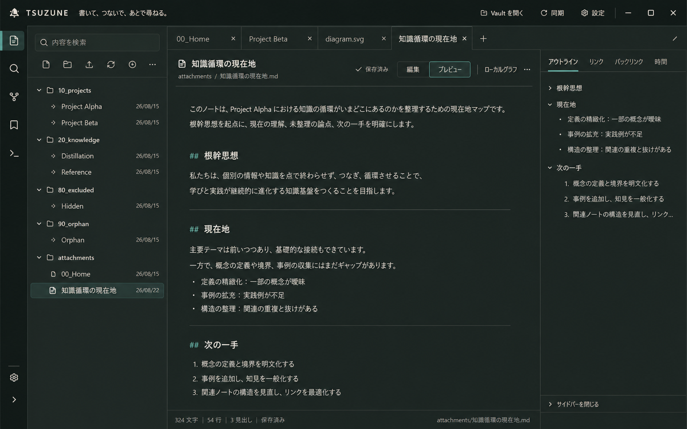

# TSUZUNE Night Workshop Dark UI target (2026-08-26)

## 結論

Obsidian参考の3ペイン構成は維持し、色と素材感を **Night Workshop / 夜の知識工房** へ振り切る。

白い画面を単純反転するのではなく、中央を暖かいcharcoalの紙面、周辺を一段ずつ暗い道具面として扱う。本文は純白を避けた明るいInk、Thread Tealは選択・接続・focusだけに絞り、長時間の読書と執筆で画面全体が発光して見えない階層を作る。

このtargetを採用し、現行shellを保ったままNight Workshopを既定dark themeとしてsource実装した。隔離fixtureによるEditor、Preview、Graph、modal、Quick Switcher、Command Palette、900px、実効最小幅のvisual確認まで完了している。

既存のライト案は設計履歴として保持しているが、runtime theme toggleは追加していない。本番installと利用者受入はまだ行っていない。

## Visual target

- 生成物: `assets/tsuzune-night-workshop-dark-target-2026-08-26.png`
- 寸法: 1586 x 992
- SHA-256: `88F1A0CA9D303DBE790DEF7C84DE53E3A53632E3924807FDEF23FDA0E213770B`
- 元にした構成: [Obsidian参考ライト案](obsidian-inspired-workspace-ui-target-2026-08-26.md)
- 用途: 実装前の高精細art-direction target。画像内のpixel値ではなく、下記token、surface hierarchy、状態契約を実装基準とする。

## Implementation result

| Boundary | Status |
| --- | --- |
| Source | 実装済み |
| Isolated fixture | 動作確認済み |
| Installed production | 未反映 |
| User acceptance | 未確認 |

- UI token / shell / editor / modal: `src/renderer/styles.css`
- Graph palette bridge: `src/renderer/components/GraphEdgeCanvas.tsx`, `src/renderer/components/WikiGraphView.tsx`
- Design source of truth: `DESIGN.md`
- Visual QA: `design-qa.md`
- Rendered evidence: `assets/night-workshop-dark-2026-08-26/01-editor-shell.png` through `10-focused-surface-comparison.png`
- Verification: `npm run typecheck`, `npm test` (840 passed, 1 skipped), `npm run check:mcp`, `npm run build`, isolated Electron capture, and `git diff --check` all passed

## 使用場面

一人の利用者が、薄暗い夜の部屋でWindows monitorに向かい、ローカルMarkdownを数時間読み書きする。中央本文は読みやすいが白く発光せず、FileTreeとContextは必要な時だけ視界へ入り、現在位置とfocusは迷わない。

## 変えるものと残すもの

### 変えるもの

- Paper / Canvasの明度関係を、暖かいcharcoalの5段階へ置き換える。
- headerだけが暗い現行構成から、workspace全体が一つの夜の作業机に見える構成へ変える。
- original Thread Tealの色相を保ちながら、暗い面でAA contrastを取れるNight Threadへ明度を上げる。
- selected、hover、focus、warning、dangerをdark surface用に定義し直す。
- 装飾gradientと常設shadowを使わず、面の明度差、罫線、余白で構造を示す。

### 残すもの

- 左は場所、中央は作業、右は文脈という3ペイン。
- activity rail、FileTree、Workspace Tabs、note header、Outline / Links / Backlinks / Timeの配置。
- Markdown正本、保存安全性、時間、出典、局所関係へ降りる導線。
- Yu Gothic UIを中心にしたsystem font、compact control、Flat Workbench。
- keyboard、ARIA、Windows convention、100から200% display scaleの品質境界。

## Dark palette contract

| Token | Value | Role |
| --- | --- | --- |
| Night Canvas | `#141A19` | 最背面、top chrome、activity rail |
| Night Sidebar | `#18201E` | FileTreeとright contextの基底面 |
| Night Surface | `#1D2623` | tab strip、toolbar、panel header |
| Night Editor | `#202925` | Markdown editor / previewの主紙面 |
| Night Raised | `#26312D` | hover、押下前、入力面の一段高い状態 |
| Quiet Line | `#36433F` | 装飾的divider。意味のある境界には使わない |
| Strong Line | `#64766F` | input、選択境界など3:1が必要な箇所 |
| Night Ink | `#E7E8E2` | 本文、見出し、重要label |
| Night Muted | `#AEB7B1` | path、date、metadata、非active control |
| Night Faint | `#9CA7A1` | 補助iconと非重要情報。本文には使わない |
| Night Thread | `#78BFB2` | active、connection、heading。画面の10%未満 |
| Night Focus | `#93D3C7` | 2px focus ringと重要な現在位置 |
| Night Selection | `#29433E` | selected row / tabの背景 |
| Night Link | `#83C9BD` | Wiki linkと到達可能な関係 |
| Night Warning | `#D5A45F` | stale、missing、recoverable attention |
| Night Danger | `#E0847D` | conflict、failure、destructive only |

純黒、純白、青黒いcyberpunk、neon、glass、glow、gradient、常設shadow、floating cardは使わない。

## Contrast evidence

WCAG relative luminanceで計算した。実装時は画像から色を抽出せず、上記の値をCSSへ直接使用する。

| Foreground / background | Ratio | Use |
| --- | ---: | --- |
| Night Ink / Night Editor | 12.12:1 | 本文、見出し |
| Night Muted / Night Editor | 7.26:1 | metadata、path |
| Night Faint / Night Editor | 6.02:1 | 非重要な補助情報のみ |
| Night Thread / Night Editor | 7.04:1 | active、heading |
| Night Link / Night Editor | 7.87:1 | link |
| Night Focus / Night Surface | 9.15:1 | focus ring |
| Strong Line / Night Editor | 3.10:1 | 意味のあるcontrol境界 |
| Night Ink / Night Selection | 8.66:1 | selected text |
| Night Muted / Night Selection | 5.19:1 | selected metadata |
| Night Warning / Night Editor | 6.62:1 | warning text / icon |
| Night Danger / Night Editor | 5.53:1 | failure text / icon |

`Quiet Line #36433F`はNight Editor上で約1.45:1のため、飾りのdividerだけに限定する。入力枠、focus、選択境界のように意味を担う線は`Strong Line`または`Night Focus`を使う。

## State contract

- Selected: `Night Selection` + `Night Ink`に、weightまたは左境界を併用する。
- Hover: `Night Raised`へ一段だけ明るくし、geometryを変えない。
- Focus: `Night Focus`の2px outlineと形状差を使い、hoverやselectedへ埋没させない。
- Disabled: opacityだけにせず、disabled semantics、操作不能、labelを維持する。重要情報をdisabled色だけで示さない。
- Warning / danger: 色だけでなくiconと明示textを併用する。
- High Contrast: paletteの見た目一致ではなく、OS強制配色下で意味、境界、focus順が残ることを合格条件にする。

## Existing implementation blast radius

新しいReact stateやapp-owned設定DBは不要で、主経路は既存CSSのsemantic token化である。ただし、Graphの描画色だけはCSS外の確認が必要になる。

| Surface | Current source | Dark migration |
| --- | --- | --- |
| Base tokens / canvas | `src/renderer/styles.css:1-17`, `77-101` | `:root`の意味tokenを拡張し、`.app-shell`のlight直書きとgradientを除く |
| Header / global state | `styles.css:111-228` | header、secondary action、overlay、warning、conflictをdark state tokenへ置換 |
| FileTree / search | `styles.css:250-555` | panel、input、tree row、selected、drop、context menu、freshnessのlight直書きを置換 |
| Tabs / note / editor | `styles.css:650-992` | inactive / active tab、CodeMirror gutter、active line、preview、properties、code、link、empty / error面を置換 |
| Right context | `styles.css:1090-1307` | panel、tabs、related link、temporal、ambiguous / invalid状態を置換 |
| Modal / palette | `styles.css:1310-1421`, `1907-1972` | white、grey、black alpha、shadow、disabledをsemantic tokenへ置換 |
| Focus / disabled | `styles.css:51-63`, `1670-1734` | focus色をtoken化し、disabledをopacity単独から状態contractへ合わせる |
| Graph | `src/renderer/components/GraphEdgeCanvas.tsx:84-125`, `WikiGraphView.tsx:134-230`, `925-1065` | Canvas edge、node label、legend、control、inline styleへ同じtheme paletteを渡す |

CSSだけをDark化して完了とすると、Graphだけ白いcontrol、読めないlabel、固定色edgeが残る可能性がある。Graphは別surfaceとして必ずvisual acceptanceへ含める。

## Minimal implementation order

### Dark-1: semantic theme foundation

- `:root`の既存色を、canvas、surface、text、line、accent、stateの意味tokenへ整理する。
- header、left、tabs、editor / preview、rightの主要面だけをNight paletteへ通す。
- DOM、workspace state、data flow、tab behaviorは変えない。
- theme toggleや永続設定を新設せず、Night Workshopを既定themeへ置換する。

### Dark-2: interaction states

- hover、focus、selected、disabled、warning、danger、conflict、drop targetを統一する。
- Quick Switcher、Command Palette、context menu、modalを同じvocabularyへ揃える。
- 色以外の状態手掛かりと既存ARIAを維持する。

### Dark-3: special surfaces

- CodeMirror、Properties、code block、Wiki link、attachment、empty / errorを確認する。
- GraphのCanvas / DOM / inline styleを同じpaletteへ接続する。
- light themeのhard-coded colorが残っていないことを検索とisolated screenshotで確認する。

### Dark-4: Windows acceptance

- 1440 x 900でvisual targetとsurface hierarchy、本文の眩しさ、active state、panel separationを比較する。
- 720px / 900px、Windows 100 / 125 / 150 / 200%で重なり、欠落、横scrollを0にする。
- keyboard focus、selected row、hover、disabled、warning、danger、長い日本語pathをfixtureで確認する。
- High Contrast、Narrator / NVDA、物理keyboard、実monitorでのglareと疲労は実OS / 利用者受入として分離する。

## Acceptance boundary

1. 通常textは4.5:1以上、大きいtextと非text focus / selection境界は3:1以上。
2. editor、FileTree、right contextのどこでも白い大面積surface、純白text、neon glowが0。
3. active / selected / focus / warning / dangerが色だけに依存せず区別できる。
4. 現行sidebar、FileTree、Workspace Tabs、note action、right tabsのkeyboard / ARIA契約を維持する。
5. source実装後はtypecheck、focused renderer tests、full tests、MCP check、isolated Electron screenshotを実行し、本番へ出す時だけ`production:update` 10/10を要求する。

## Intentional deviations and unverified boundaries

- `DESIGN.md`はNorth Starを維持したまま、「紙の温度」をwarm charcoalへ翻訳するNight Workshop正本へ更新した。
- 生成画像は色、面、密度のart directionで、実際のCSS pixel、font antialiasing、native control、1440 x 900の証拠ではない。
- 画像のsmall textは実装copyやDOM contractの正本ではない。既存copyとaccessible nameをsourceから維持する。
- 実Windows High Contrast、125 / 150 / 200% DPI、色収差、長時間の眼精疲労、Narrator順は、隔離fixtureでは未確認。
- ライト案は設計履歴として削除していない。Night Workshopを既定darkにする判断は確定し、選択式themeは今回のscope外とした。

## Generation prompt contract

- Image 1をedit targetとし、canvas、window frame、全panel geometry、tab、icon位置、日本語copy、line wrappingを不変条件にした。
- use caseは`style-transfer`、用途はshippable desktop product UI art-direction mockupとした。
- Night paletteの16色、accent 10%未満、暖かいcharcoal paper、flat structural surfaceを指定した。
- pure black / white、neon、cyberpunk、glass、gradient、glow、shadow、floating card、texture、追加要素を禁止した。
- built-in Image Genで生成し、workspaceへ非破壊copyした。元の生成物とライト案は保持している。

## TSUZUNE handling

production TSUZUNEは開始時にread-onlyで、`30_知識/TSUZUNE-UX・デザインシステム`、`30_知識/TSUZUNE-Obsidian級Daily Workspace改善設計-2026-08-17`、`30_知識/TSUZUNE-根幹思想-知識循環と構造探索`を確認した。

検証完了後、`30_知識/TSUZUNE-Night-Workshop標準ダークUI実装-2026-08-26.md`の作成と、既存設計note / project noteへの最小link追加を試みたが、登録中MCPの`stale_runtime: true`安全ガードによりwriteは拒否された。Vaultは変更されていない。

未同期内容は、source実装済み、隔離fixture動作確認済み、本番未反映、利用者未確認、activity rail / compact header / richer tabs / Outlineは後続slice、という本reportの境界である。MCPを正規手順で再登録・再起動した後、このsource noteを作成し、`[[TSUZUNE-Obsidian級Daily Workspace改善設計-2026-08-17]]`と`[[TSUZUNE]]`へ一度ずつ接続する。
