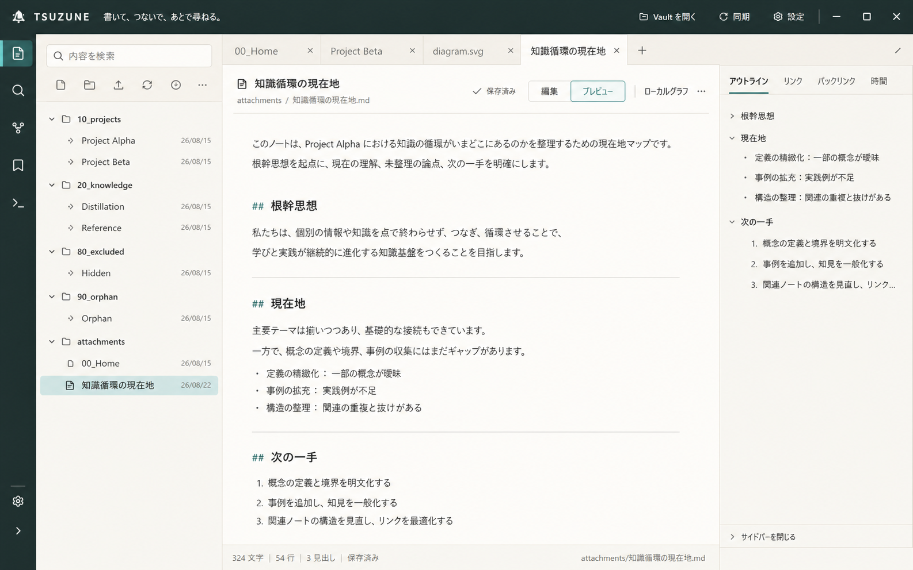

# TSUZUNE Obsidian参考 Daily Workspace UI target (2026-08-26)

## 結論

画面構成と操作の置き場所はObsidianへ近づけ、色、Markdown正本、保存安全性、時間と出典、知識循環はTSUZUNEを維持する。

今回のvisual targetは、現行の3ペインを捨てずに、上部chromeと左操作群の占有量を減らし、中央の読書・執筆面を広げる方向を示す。2026-08-27にsource実装、本番install、隔離runtime確認まで完了した。利用者による長時間評価と実Windows支援技術の受入はまだ行っていない。

## Implementation result (2026-08-27)

- header、workspace tabs、note actionsをcompact化し、Preview／Editorを72chのreading columnへ揃えた。
- left panel内へ常設Activity Railを追加し、Files、Search、Graph、Bookmarks、Commands、sidebar toggleを既存handlerへ接続した。
- right contextへOutlineを追加した。frontmatterとfenced codeを除外するATX h1〜h6抽出、Preview anchor、Editor source offset jumpを既存tab／editor契約へ統合した。
- 900 CSS px以下でright、720 CSS px以下で左右panelを自動collapseする。どちらも手動再openを妨げず、720pxでもActivity Railを残す。
- 新規dependency、保存model、DB、plugin／theme systemは追加していない。

検証画像と構造assertionは [`assets/obsidian-structural-ui-2026-08-27/`](assets/obsidian-structural-ui-2026-08-27/) に保存した。最終結果は [`capture-result.json`](assets/obsidian-structural-ui-2026-08-27/capture-result.json)、本番境界は [`production-update-latest.json`](production-update-latest.json) を正本とする。

## Visual target

- 生成物: `assets/tsuzune-obsidian-inspired-workspace-target-2026-08-26.png`
- 寸法: 1586 x 992
- SHA-256: `CF9AD9F46C4C6C7B5CB8EAA0777605AAEAF3FEE634F9751BE275669E91C99CC1`
- 用途: 実装前の高精細visual target。文字の細部やpixel一致ではなく、構成、密度、階層、色の基準とする。

## Reference evidence

1. TSUZUNE current shell: [R5 tabs baseline](assets/workspace-tabs-r5-2026-08-22/a6-tabs-baseline.png)
   - 1440 x 900、R5 acceptance済み。
   - 左は場所、中央は作業、右は文脈という現行構造、workspace tabs、長い日本語tab名を確認した。
2. Obsidian structural reference: [Obsidian 1.13.4 Graph baseline](assets/graph-gp0-attachment-new-tab/obsidian-1.13.4/00-baseline.png)
   - 1265 x 768、固定fixtureと隔離profile。
   - compactなtitle chrome、activity rail、file explorer、tab strip、dock型panelの配置だけを参照した。

同一flow、同一viewportの比較画像ではないため、pixel parityや優劣の証拠には使わない。Obsidian画像はGraph専用であり、通常note editorやR6 Reading Surfaceの完成度は比較していない。

### Intentional deviations and risks

- 生成画像は1586 x 992で、実装acceptanceの1440 x 900と同一寸法ではない。下記Layout contractの数値を実装基準とする。
- activity railとOutlineはvisual target作成時には未実装だったが、2026-08-27の構造UI sliceで実装・本番反映した。画像自体は引き続きart directionであり、完成画面のpixel parity証拠ではない。
- 生成画像内のicon、folder名、本文、余白はart direction用で、正確なproduct copyやDOM contractではない。
- icon-only controlを実装する場合は、tooltip、accessible name、focus stateを必須とする。

## Layout contract

| Surface | Target | 理由 |
| --- | --- | --- |
| Global header | 約40px、Workshop Night。markと製品名は左、Vault・同期・設定は右の静かなcluster | 現行58px headerの占有量を減らし、低頻度操作を本文より弱くする |
| Activity rail | 約40px。Files、Search、Graph、Bookmarks、Commandsを同一line iconで表示 | 左の大型button gridを、場所切替として認識しやすい入口へまとめる |
| File explorer | 約236px、28px前後のrow、compactなsearchとfile toolbar | treeを主役にし、folder階層を一目で走査しやすくする |
| Workspace tabs | 約36px、中央surfaceと一体化。active、hover、focusを形と色で区別 | R5のkeyboard / ARIA契約を保ったまま、作業対象を読みやすくする |
| Note header | title、path、save state、Edit / Preview、Local Graphを一段の明確な階層へ整理 | 頻用操作と文脈操作の競合を減らす |
| Reading surface | 約65から75文字の中央column、Paper、十分な行間 | 文章を読み続けても視線移動が広がりすぎない |
| Right context dock | 約260px。Outline、Links、Backlinks、Timeの4 tabs | 現在noteの構造と関係へ同じ場所から降りる |

### Narrow width

- 1440px: 3ペインを表示する。
- 900px: right contextを先にcollapseし、明示toggleを残す。
- 720px: left / rightをcollapseし、中央とtab操作を維持する。
- Windows 100から200% scaleで、重なり、欠落、document横scrollを発生させない。

## Existing implementation map

| Target | Existing source to reuse | 最小変更 |
| --- | --- | --- |
| Compact global chrome | `src/renderer/styles.css` `.app-header`、`.brand`、`.vault-summary` | height、spacing、visual weightを調整。既存actionとbusy / inert契約は維持 |
| Left navigation hierarchy | `src/renderer/App.tsx` left panel、search、tree toolbar、`FileTree` | 第一sliceではstateを増やさず、既存actionのvisual priorityを整理。activity rail化は別slice |
| Tabs | `WorkspaceTabBar`、`.workspace-tabs`、`.workspace-tab` | active境界、密度、editorとの連続性だけを調整。R5 behaviorは変更しない |
| Note header | `.note-header`、`.note-actions`、`.note-view-switcher` | 余白とgroup hierarchyを調整。save stateとLocal Graphの意味は維持 |
| Reading width | `.markdown-preview`、CodeMirror scroller | 65から75文字のcontent columnを既存surface内で実現 |
| Right dock | `RelatedNotes`と`TemporalDetails` | 現行3 tabsを維持。Outline追加はheading extractionとjumpを含む別の機能slice |

新しいdesign framework、plugin system、account、cloud、telemetry、app-owned note database、常駐runtimeは追加しない。

## Implemented order

### UI-1 Reading Workspace Shell

最初は状態やdata flowを変えないCSS中心のsliceとする。

- header、tabs、note headerのvertical densityを揃える。
- left action群のvisual priorityを下げ、FileTreeを主役にする。
- Preview / Editorの本文を65から75文字へ収める。
- Paper / Canvas / Ink / Thread Tealを維持する。

Public outcome: noteを開いた時、本文が最も大きな作業面として見え、tab、FileTree、contextの位置をObsidian利用者が説明なしで判別できる。

### UI-2 Activity rail

既存actionをFiles、Search、Graph、Bookmarks、Commandsの細いrailへ再配置する。新しいsearch engineやworkspace modelは作らない。今日のノート、note作成、folder作成、idea captureはfile toolbarまたは既存command paletteへ残す。

### UI-3 Outline context tab

現行right contextへOutlineを追加し、active noteのheading一覧とjumpを提供する。Links、Backlinks、Timeと同じARIA tab contractを再利用する。Graphやdatabaseとは結合しない。

見た目の整理とOutlineの機能実装は同じsliceへ混ぜない。

## Acceptance boundary

1. 1440 x 900でvisual targetと、header、rail / explorer、tabs、reading width、right dockの5点を比較する。
2. 900pxと720pxで、document横scroll、control重なり、本文消失が0。
3. 現行sidebar、FileTree、Workspace Tabs、note action、right tabsのkeyboard / ARIA testsを維持する。
4. text contrastはWCAG 2.2 AA、focusは色だけに依存せず、reduced motionを維持する。
5. source実装後はtypecheck、focused renderer tests、full tests、MCP check、isolated Electron screenshotを実行する。本番へ出す時だけ`production:update` 10/10を要求する。

実Windows Narrator / NVDA、High Contrast、物理100から200% DPIは自動testの代替にせず、別の受入境界として記録する。

### Acceptance result (2026-08-27)

- focused UI／heading tests: 5 files、101 PASS。
- full tests: 82 files PASS・1 SKIP、853 PASS・1 SKIP。
- `npm run typecheck`、`npm run check:mcp`、`npm run build`、`git diff --check`: PASS。
- isolated Electron: 1424、900、720相当でOutline、responsive collapse、Activity Rail残存、横overflowなし、dialog focus／background inertを確認。
- `npm run production:update`: 10/10 PASS。built／installed executableと`app.asar`のSHA-256一致、production profile 61 files／digest不変、installed renderer ready。
- 利用者確認、物理125／150／200% DPI、High Contrast、Narrator／NVDAは未確認。

## Generation prompt contract

- Image 1をTSUZUNEのbrand、content、3ペイン意味のedit targetとした。
- Image 2をObsidianのcompact chrome、activity navigation、tabs、densityのstructural referenceとした。
- 16:10のshippable product UI、左は場所、中央は作業、右は文脈、約70文字のreading column、Outline / Links / Backlinks / Time dockを指定した。
- Paper `#FFFDF8`、Canvas `#F4F0E7`、Ink `#292822`、Workshop Night `#283B38`、Thread Teal `#2F655F`、Soft Thread Teal `#DCEBE6`を維持した。
- glassmorphism、gradient、floating cards、neon、account / collaboration、plugin marketplace、AI chat、fake metrics、marketing copyを禁止した。
