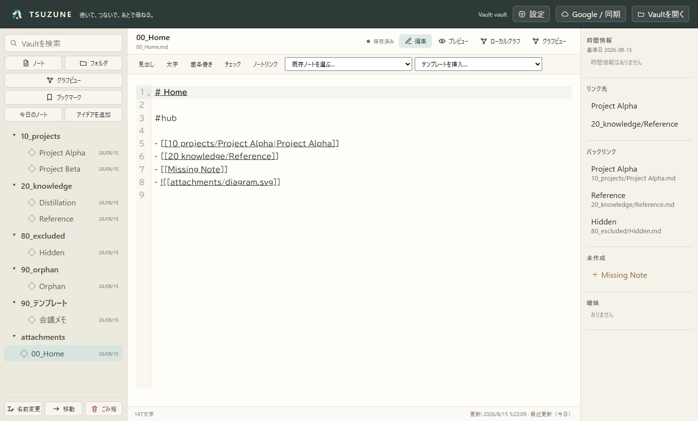
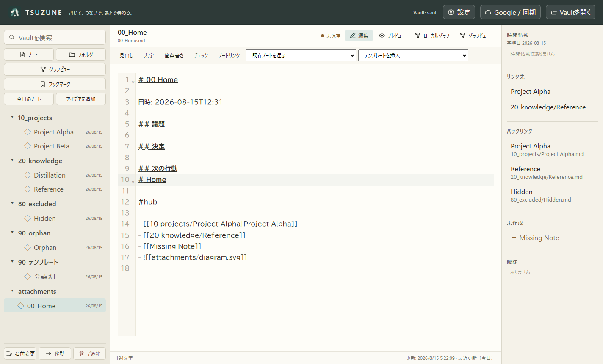
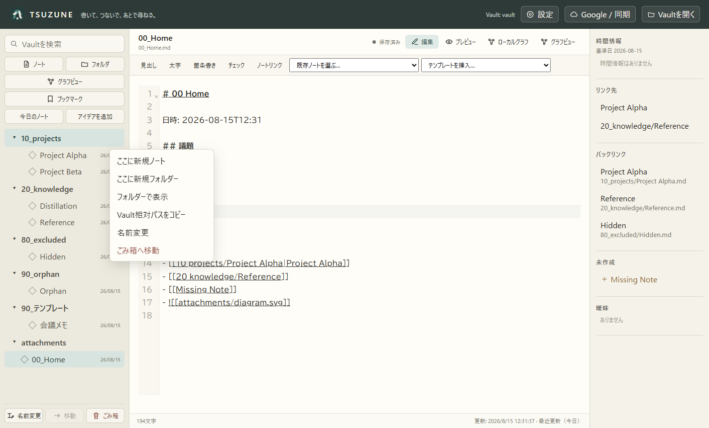
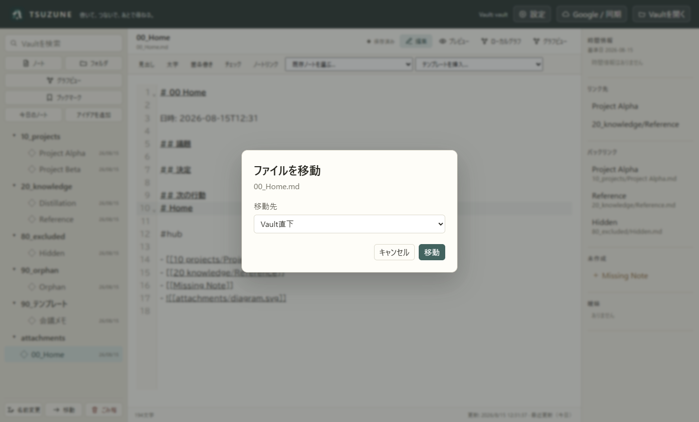

# TSUZUNE テンプレート／フォルダ UX調査・改善案

調査日: 2026-08-15
状態: research-only（製品コード、本番Vault、本番アプリは変更していない）

## 結論

「便利だがObsidianより自由度が低い」という感覚は、現行実装と一致する。

- テンプレートはMarkdownをカーソル位置へ挿入できる点ではObsidian方式へ近づいたが、保存フォルダが`90_テンプレート`固定、内蔵4件が常時候補、管理導線がなく、日次／アイデアの専用導線とも役割が重なる。
- フォルダは作成・名前変更・ごみ箱移動ができる一方、フォルダ自体の移動とdrag-and-dropがない。ノート移動だけが別ダイアログへ分離され、Vaultを育てながら組み替える操作が弱い。
- 問題は機能数より、TSUZUNEの既定構造が「外せる初期値」ではなく「固定された操作モデル」になっていることにある。

目標はObsidian全機能の複製ではなく、`強い初期値 + 通常のMarkdown／フォルダ操作を妨げない逃げ道`とする。

## 調査範囲

- 対象: current dirty working treeのテンプレート挿入、テンプレート列挙、ノート／フォルダ作成、名前変更、移動UI。
- 画面: 匿名fixtureを複製した隔離Vault、隔離user-data、1424×861 viewport。
- 比較: 2026-08-15取得のObsidian公式Help。
- 検証: `npm run build` PASS。製品テスト、production update、実Windows screen reader、実ポインタdragは今回のresearch-only範囲外。

## 操作監査

### Step 1 — 編集画面からテンプレートを選ぶ: PARTIAL

良い点:

- 通常のMarkdown編集画面に留まり、テンプレートも普通のMarkdownとして扱う。
- selectには`テンプレートを挿入`のaccessible nameがあり、キーボードで操作できる。
- Vault内の`90_テンプレート`配下を再帰的に候補化できる。

問題:

- `src/core/templates.ts`でテンプレートフォルダが`90_テンプレート`へ固定されている。
- 内蔵4件と利用者作成テンプレートが同じ一覧に混在し、内蔵／Vault由来を区別できない。
- 表示名がbasenameだけなので、入れ子内の同名テンプレートを見分けられない。
- current diffでは旧`テンプレートを追加`を削除したが、代わりの「テンプレートを作る／開く／管理する」導線がない。
- `docs/templates-and-freshness.md`は旧「テンプレートから作成／テンプレートを追加」方式のままで、current UIとずれている。

### Step 2 — カーソル位置へテンプレートを挿入する: PARTIAL

良い点:

- 選択範囲を置換し、カーソル位置へ展開済みMarkdownを挿入する。Obsidianの中核動作と同じ方向である。
- `{{title}}`、`{{date}}`、`{{time}}`、`{{datetime}}`をローカルで展開し、未知の記法を勝手に消さない。

問題:

- 既存ノート先頭へ全体テンプレートを挿入すると、画像のようにH1が二つになりうる。挿入自体は正しいが、全体雛形と部分snippetが一覧上で区別されない。
- 日付／時刻formatは固定。Obsidianはテンプレートフォルダ、既定の日付／時刻format、個別format stringを設定できる。
- command palette／hotkey相当の別入口は現行コードにない。
- `今日のノート`と`アイデアを追加`は別の専用ワークフローであり、テンプレート＝本文挿入という単純な概念と競合する。特に`アイデアメモ`はテンプレート候補と専用フォームの両方に存在する。

### Step 3 — フォルダのcontext menuから整理する: INCOMPLETE

良い点:

- 選択フォルダ内へのノート／サブフォルダ作成、Explorer表示、path copy、名前変更、ごみ箱移動が一か所に揃う。
- `role=menu`／`menuitem`、初項目focus、Escape復帰が実装されている。

問題:

- フォルダcontext menuに`移動`がなく、backendの`moveNote`もMarkdown／添付だけを受ける。階層を作り直すには外部Explorerが必要になる。
- FileTreeにdrag-and-drop経路がない。Obsidianはファイルとフォルダの両方をdrag-and-dropまたはcontext menuで移動できる。
- 上部の`ノート`／`フォルダ`は現在のtree selectionから保存先を暗黙決定する。button自体には「どこに作るか」が表示されない。
- フォルダ作成は`window.prompt`、ノート作成は`無題のノート`を即作成して後から名前変更する。どちらも作成時にtree上で名前を確定するObsidianより操作が分断される。

### Step 4 — ノートを別フォルダへ移動する: PARTIAL

良い点:

- focus移動、Tab trap、Escape、元focus復帰があり、操作は明示的で安全。
- 既存の衝突防止、link impact確認、creation-time移動を維持できる。

問題:

- 対象はノート／添付だけでフォルダに再利用できない。
- 移動先は全folder pathの平坦なselectで、検索、階層表示、最近使った場所がない。小規模Vaultでは十分だが、folder数が増えると選択負荷が上がる。
- FileTreeから直接移す操作と、ダイアログで選ぶ操作がつながっていない。

## Obsidian公式仕様との比較

| 項目 | Obsidian | TSUZUNE current | 判定 |
|---|---|---|---|
| テンプレート正本 | 指定folder内の通常note | `90_テンプレート`内の通常note + virtual内蔵4件 | partial |
| テンプレートfolder | Settingsで任意指定 | 固定 | missing |
| 挿入 | active noteのcursor位置 | active noteのcursor位置 | matched-core |
| 動的値 | title、date/time、format string、既定format | title、固定date/time、独自datetime | partial |
| テンプレート呼出し | ribbon、command palette、hotkey | editor toolbar select | partial |
| 新規note／folder | File Explorerで名前を入力して作成 | note即作成後rename／folder prompt | partial |
| note移動 | drag-and-drop、context menu | context/bottom操作 → select dialog | partial |
| folder移動 | drag-and-drop | なし | missing |
| sort／auto-reveal／一括開閉 | File Explorerに標準導線 | 今回対象のFileTreeにはなし | missing、ただしP0外 |

比較根拠:

- [Obsidian Templates](https://obsidian.md/help/plugins/templates)
- [Obsidian File explorer](https://obsidian.md/help/plugins/file-explorer)
- [Obsidian Daily notes](https://obsidian.md/help/plugins/daily-notes)

## 改善原則

1. テンプレートは「note type」ではなく「通常Markdownの挿入元」に限定する。
2. Daily／Ideaは独立したquick-captureとして扱い、必要なら利用者が指定したtemplate noteを参照する。
3. folderは分類規則ではなくfilesystem上の通常containerとして、作成・改名・移動・ごみ箱を対称に扱う。
4. 現行の衝突防止、link impact確認、revision／data-loss guard、keyboard代替は簡略化しない。
5. plugin system、template DSL、DB、drag libraryは追加しない。Markdown、既存Vault API、native HTML drag-and-drop、既存dialogを再利用する。

## 推奨改善順

### P0-A — フォルダ移動を閉じる

最優先。現在できない操作を一つ埋める。

- `moveNote`を雑に拡張せず、既存のrename／collision／symlink／creation-time処理を共有してnote／attachment／folderを扱う一つの明示move契約にする。
- folder context menuと下部toolbarへ`移動`を追加し、現行MoveDialogをfolderでも使う。
- 自分自身または子孫への移動、同名衝突、Vault外、保護path、link impactをfail-closedにする。
- まずcontext menu + dialogを完成させる。native drag-and-dropは同じmove契約を呼ぶ薄い第二入口として次の小sliceにする。

完了条件:

1. noteとfolderを任意の既存folder／Vault直下へ移動できる。
2. folder配下のnote、選択状態、open tab、creation-time、Path Alias／link impact境界が保たれる。
3. mouseなしでも同じ操作ができ、衝突時に既存内容を上書きしない。

### P0-B — テンプレートの所有権を利用者へ戻す

- Settingsへ`テンプレートフォルダ`を一項目追加し、既定値だけを`90_テンプレート`にする。Vault内の既存folderだけを選び、自動作成はしない。
- `内蔵テンプレートを候補に表示`をon/off可能にする。既定onで現利用者を壊さない。
- pickerはcustom templateをfolder-relative pathで表示し、同名を識別できるようにする。
- `テンプレートフォルダを開く`を一つだけ追加する。template専用managerや新DBは作らない。作成・編集・改名は通常note／folder機能を使う。
- 挿入時のcursor semanticsは現行を維持する。全体雛形／snippetの分類機能は、実需要が観測されるまで追加しない。

完了条件:

1. 任意folderとその配下のMarkdownだけをtemplate sourceにできる。
2. 内蔵4件を非表示にしても既存MarkdownやDaily／Ideaデータを変更しない。
3. nested同名templateをpathで見分け、通常noteとして開いて編集できる。

### P1 — 日常操作の摩擦を減らす

- note／folderの新規作成をtree内inline namingへ統一する。
- folder数が多い実測で困った場合だけ、MoveDialogを検索可能にする。
- date/time format stringとhotkey相当は、テンプレートfolder自由化後の利用観測で優先度を決める。
- sort、auto-reveal、expand/collapse allはfolder整理の反復摩擦が確認されたものから一件ずつ足す。

## 今回やらないもの

- Obsidian plugin互換、Templater互換、JavaScript実行template。
- template marketplace、template database、template type schema。
- 複数選択／bulk move、custom sort、folder noteなど、今回の違和感を解く前の拡張。

## Evidence limits

- 画面監査は隔離fixtureとprogrammatic UI action。実マウスdrag、screen reader、High Contrast、multi-DPIは未確認。
- Obsidian比較は公式Helpの現行記述。pixel identityや全context-menu項目の一致は目的にしていない。
- current sourceは未コミットで、production receipt上は同snapshotがinstalled-and-verifiedと記録されているが、今回production runtimeを再操作していない。
- 機械可読観測: [observations.json](assets/template-folder-ux-audit-2026-08-15/observations.json)
